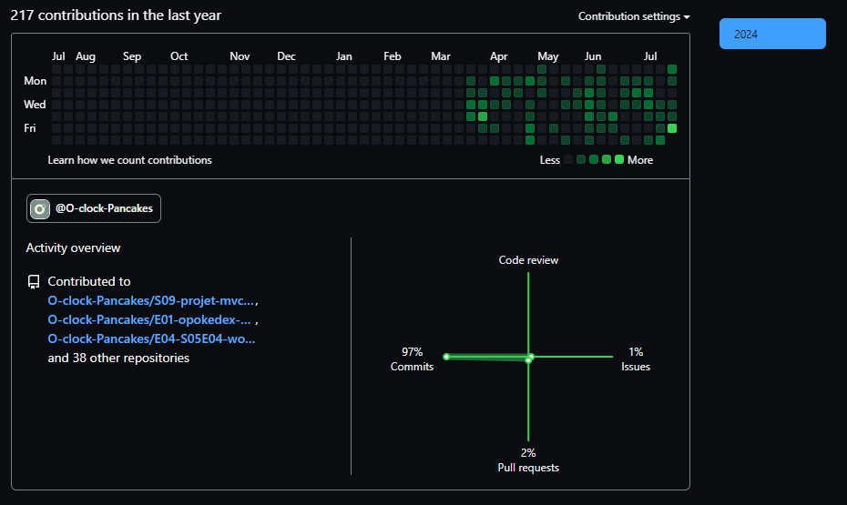

# 👋👋👋 Salutations et bienvenue sur mon profil GitHub 🌱

---------- ANNONCE: Je cherche un stage du 23/09/24 au 19/11/24, puis un boulot ou une alternance par la suite !--------------

## 🛠 Compétences actuelles (ça va évoluer vite d'ici la fin de la formation, et encore après 😄):
- **Langages**: HTML, CSS, Javascript, Typescript, SQL
- **Bibliothèque**: React/typescript
- **Framework**: Express, Svelte/typescript
- **Environnement d'exécution**: Node.js
- **Base de données**: PostgreSQL
- **Outils**: Git, Docker
- **Moteur de templates**: EJS

## 🚀 Projets

### [O'Coffee](https://github.com/FlorentGarcia369963/OcoffeeFlo)
A partir de la demande d'un client fictif, élaborer un site vitrine pour une boutique de café, puis en faire un site de e-commerce. C'est à la 9ème semaine de la formation O'Clock que ce projet a été réalisé, après 2 mois d'apprentissage intensif.

### [SPA-Monoreposiroty-Prokedex](https://github.com/FlorentGarcia369963/Monorepo-SPA-pokedex)
Projet réalisé la 14ème semaine de la formation O'Clock. Mise en place d'un Pokédex en ligne via une API, en Single-Page-Application. Il n'y a pas de routage, vous trouverez donc une certaine quantité de modales =D . Pas de Framework ici, tout est en JS vanilla, React ne sera abordé que la semaine d'après.

### [Exercice React](https://github.com/FlorentGarcia369963/Exercice-React)
Projet réalisé entre les semaines 17 et 18 (2 semaines de congés qui m'ont permis de travailler entre autre React et Svelte). C'est un exercice bonus donné pour approfondir un peu React. Le but était de mettre en place un contexte d'authentification avec JWT. Le Backend était fourni au démarrage de l'exercice, il a fallu s'approprier le code.

## 📫 Contact
- **Email**: [sahdry@hotmail.fr](mailto:sahdry@hotmail.fr)
- **LinkedIn**: [Visitez mon profil!](https://www.linkedin.com/in/florent-garcia-dev/)

## 🌱 Apprentissages en cours:
- Approfondissement de ReactJS (vu: props, hooks basiques(useState, useEffect, useContext, useCallback), hook personnalisé pour le provider)
- Approfondissement de typescript
- Svelte (vu: toute la partie basique: composants, binding, props, évènements, stores, logiques)
- AdonisJS à suivre
- Next.js prévu

## 🌟 Stats
### Mes stats d'utilisation des langages d'après GitHub

### Voici la véritable image de mes activités du début de ma formation au 26/07/24:

<!--
**FlorentGarcia369963/FlorentGarcia369963** is a ✨ _special_ ✨ repository because its `README.md` (this file) appears on your GitHub profile.

Here are some ideas to get you started:

- 🔭 I’m currently working on ...
- 🌱 I’m currently learning ...
- 👯 I’m looking to collaborate on ...
- 🤔 I’m looking for help with ...
- 💬 Ask me about ...
- 📫 How to reach me: ...
- 😄 Pronouns: ...
- ⚡ Fun fact: ...
-->

