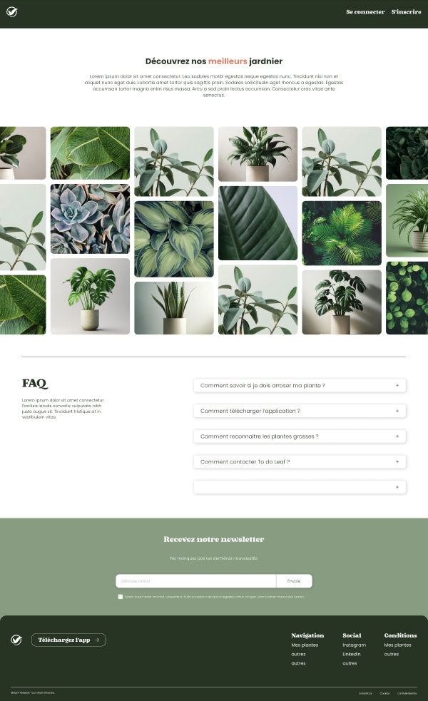
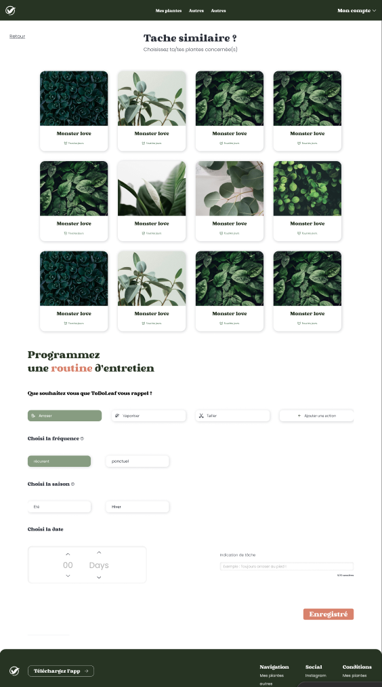
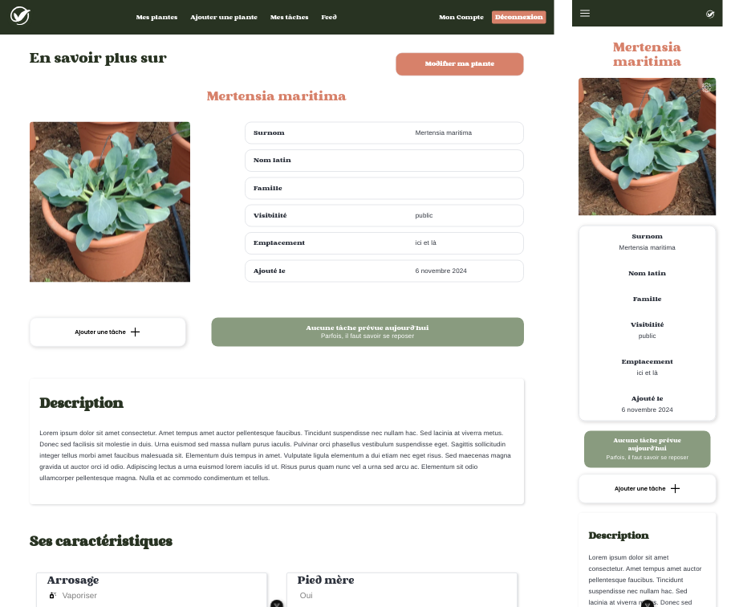
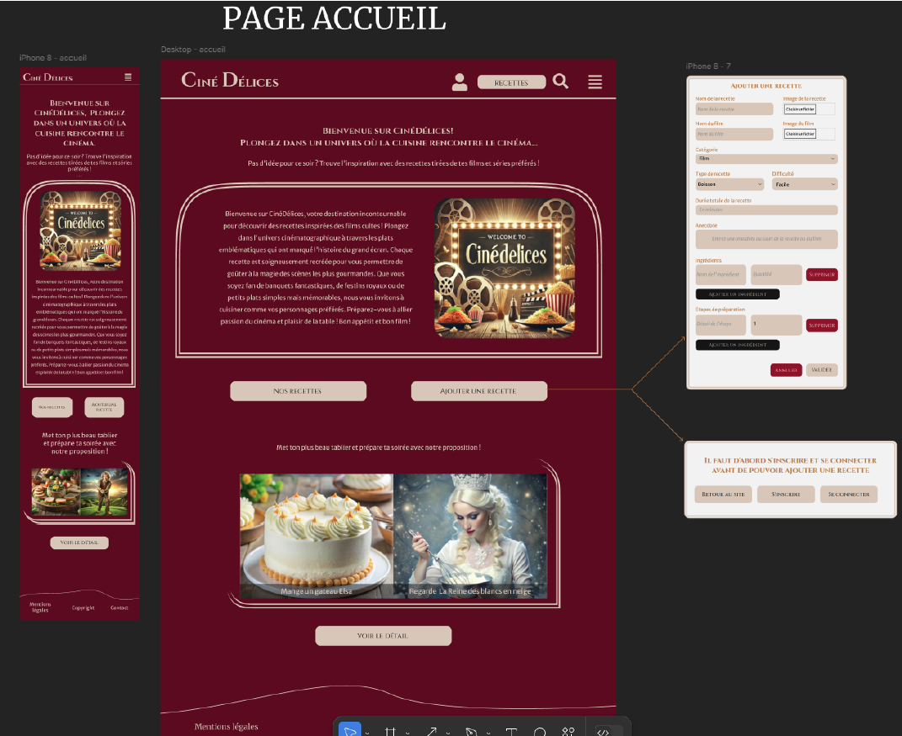
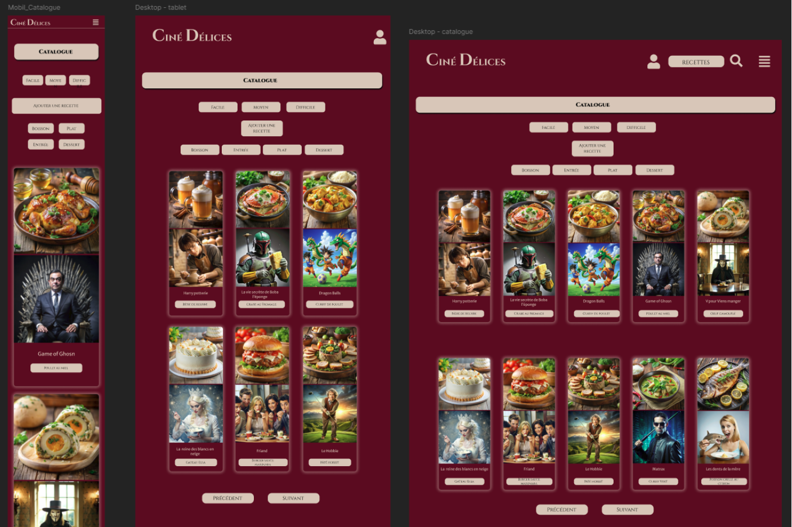
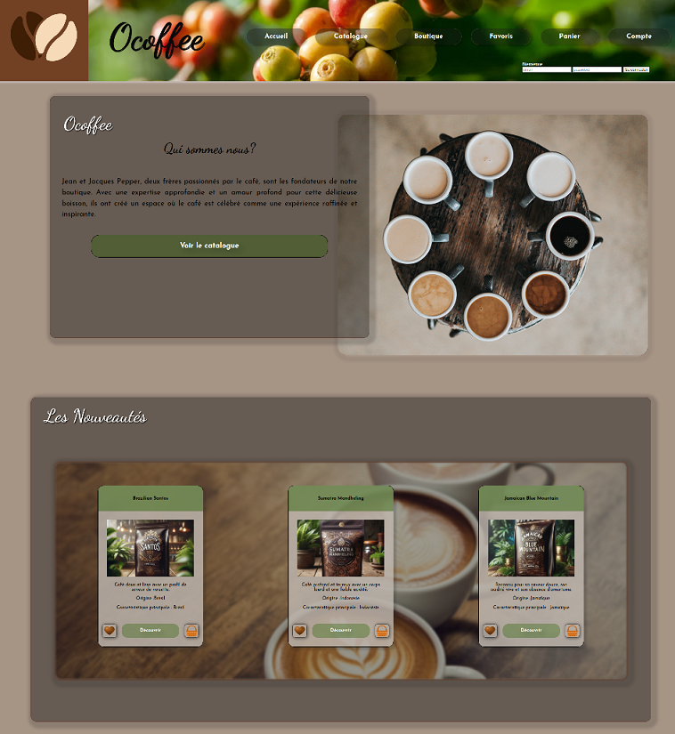
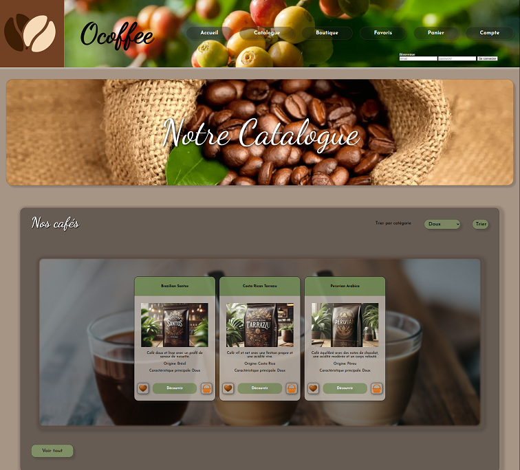
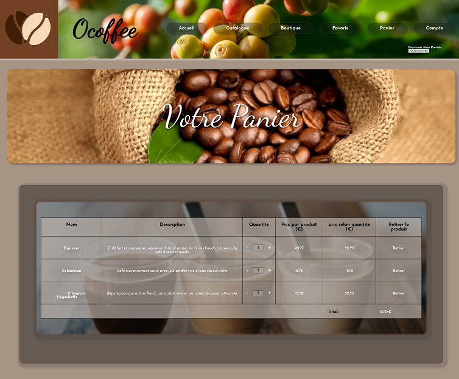

# 👋👋👋 Salutations et bienvenue sur mon profil GitHub 🌱

---------- ANNONCE: En recherche d'une alternance ou d'un poste en CDD/CDI :)--------------

## 🛠 Compétences actuelles:
- **Langages**: HTML, CSS, SASS/SCSSS Javascript, Typescript, SQL
- **Bibliothèque**: React/typescript
- **Framework Front-End**: VueJS3, Svelte/Typescript
- **Framework Back-End**: Express, Laravel, Symfony
- **Framework CSS**: Tailwind CSS
- **Environnement d'exécution**: Node.js
- **Base de données**: PostgreSQL, SupaBase
- **Outils**: Git, Docker
- **Moteur de templates**: EJS, Twig

## 🚀 Projets

### [Social Secu](https://github.com/FlorentGarcia369963/social_secu)
Il s'agit de développer une application web simple permettant le transfert de fichiers en vue du traitement d'une demande. 
Réalisé avec symfony 6.4, moteur de template Twig, un peu de javascript, et bootstrap pour le front-end.

### Todoleaf(https://github.com/Todoleaf)
Stage de 2 mois réalisé de septembre à novembre 2024 pour le développement d'un outil de gestion de plantes (prévoir différents traitements pour nos plantes afin d'en prendre soin au mieux).
Front-end avec VueJS3, TailwindCSS, back-end avec Laravel, base de données sur SupaBase.

### CinéDélices front-end(https://github.com/O-clock-Pancakes/cinedelices-front), back-end(https://github.com/O-clock-Pancakes/cinedelices-back) 
Un client (fictif!) dont la spécialité est la diffusion de films, séries et mangas en streaming nous a contacté car il souhaite mettre en oeuvre une stratégie qui pourrait le propulser au-delà de ses grands concurrents. Il s’agit de créer une communauté autour de la cuisine inspirée voire tirée de leurs diffusions. Il a donc besoin de nos services pour créer un site qui proposerait des recettes originales rattachées à une diffusion, et de donner l’occasion aux utilisateurs inscrits de proposer leurs propres recettes et anecdotes, puis pour mettre en place un système de commentaires, et de likes.

### [O'Coffee](https://github.com/FlorentGarcia369963/OcoffeeFlo)
À partir de la demande d'un client fictif, élaborer un site vitrine pour une boutique de café, puis en faire un site de e-commerce. C'est à la 9ème semaine de la formation O'Clock que ce projet a été réalisé, après 2 mois d'apprentissage intensif.

### [SPA-Monoreposiroty-Prokedex](https://github.com/FlorentGarcia369963/Monorepo-SPA-pokedex)
Projet réalisé la 14ème semaine de la formation O'Clock. Mise en place d'un Pokédex en ligne via une API, en Single-Page-Application. Il n'y a pas de routage, vous trouverez donc une certaine quantité de modales =D . Pas de Framework ici, tout est en JS vanilla, React ne sera abordé que la semaine d'après.

### [Exercice React](https://github.com/FlorentGarcia369963/Exercice-React)
Projet réalisé entre les semaines 17 et 18 (2 semaines de congés qui m'ont permis de travailler entre autre React et Svelte). C'est un exercice bonus donné pour approfondir un peu React. Le but était de mettre en place un contexte d'authentification avec JWT. Le Backend était fourni au démarrage de l'exercice, il a fallu s'approprier le code.

## 📫 Contact
- **Email**: [sahdry@hotmail.fr](mailto:sahdry@hotmail.fr)
- **LinkedIn**: [Visitez mon profil!](https://www.linkedin.com/in/florent-garcia-dev/)

## 🌱 Apprentissages en cours:
- Symfony
- VueJS
- En recherche d'un poste titulaire ou en alternance, la priorité ira sur les technologies utilisées sur le poste

<!--
**FlorentGarcia369963/FlorentGarcia369963** is a ✨ _special_ ✨ repository because its `README.md` (this file) appears on your GitHub profile.

Here are some ideas to get you started:

- 🔭 I’m currently working on ...
- 🌱 I’m currently learning ...
- 👯 I’m looking to collaborate on ...
- 🤔 I’m looking for help with ...
- 💬 Ask me about ...
- 📫 How to reach me: ...
- 😄 Pronouns: ...
- ⚡ Fun fact: ...
-->

